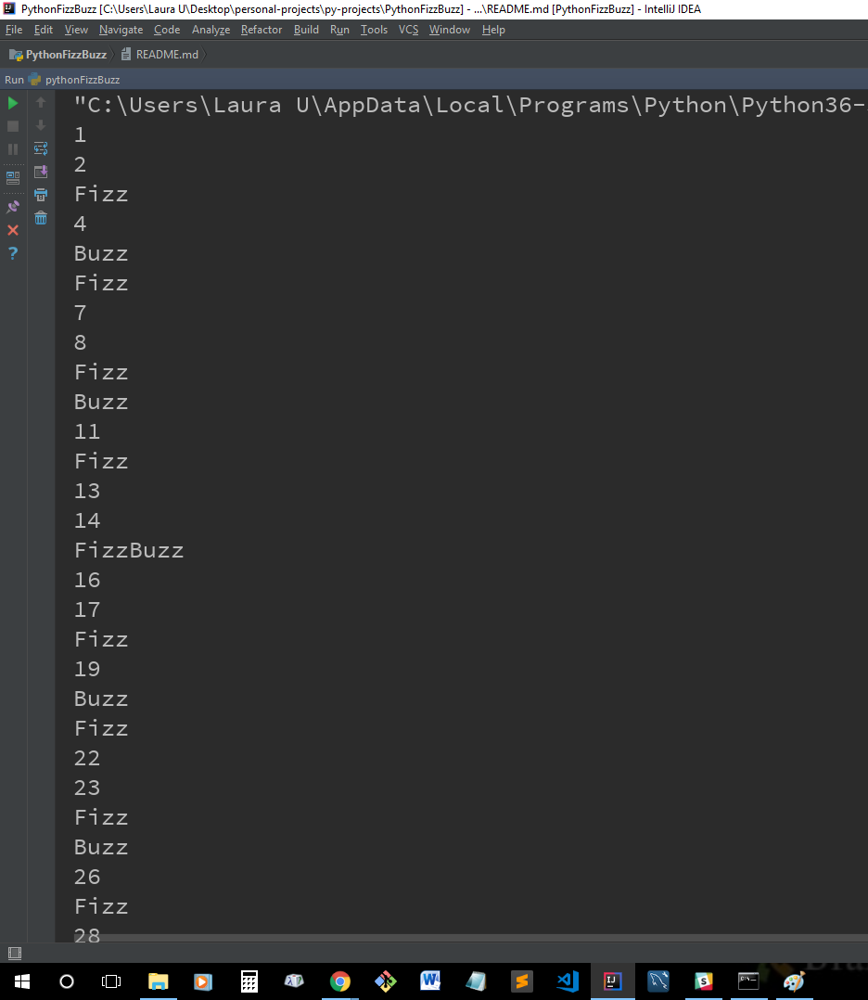

# Python FizzBuzz
## Rules:
* Print numbers from 1 to 100, inclusive.
* If the number is divisible by 3, print "Fizz" instead of the number.
* If the number is divisible by 5, print "Buzz" instead of the number.
* If the number is divisible by both 3 and 5, print "FizzBuzz" instead of the number.

## Sample Image of Results
